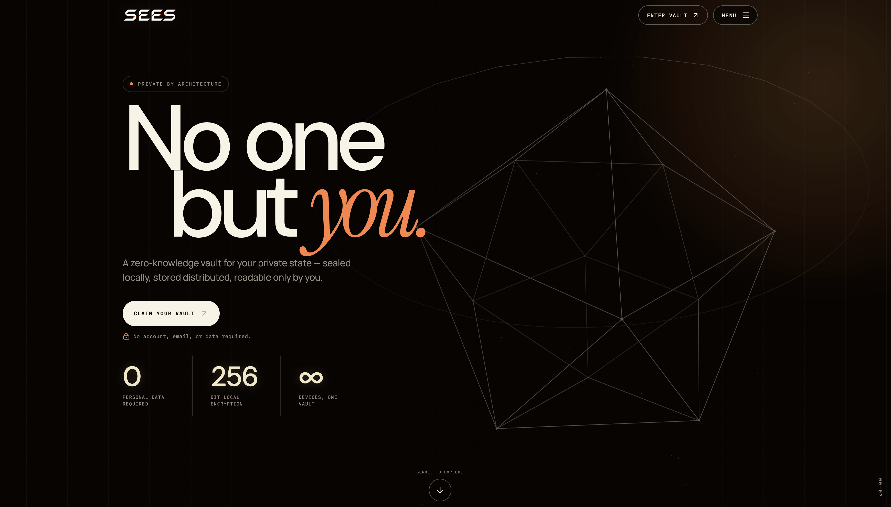

<div align="center">



<br><br>

[](LICENSE)
[](https://www.sees.im)
[](https://tanstack.com/start)

**Zero-knowledge encrypted notes. Your passphrase never leaves your device.**

[Live app](https://www.sees.im) · [Security model](https://www.sees.im/security) · [Whitepaper](public/sees-whitepaper.pdf) · [FAQ](https://www.sees.im/faq)

</div>

---

## What this is

SEES is a vault for notes and files where the server only ever stores ciphertext. There's no account, no email, and no recovery key — the encryption key is derived locally from a passphrase and never transmitted.

- **PBKDF2-SHA256, 250,000 iterations** derives an AES-256 key in-browser from a Vault ID + passphrase
- **AES-256-GCM** seals every note before it touches storage, giving confidentiality and tamper detection
- **Fragment-based sharing** — a share link's decryption key lives in the URL fragment, the part of a URL browsers never send to a server
- No plaintext backup, no server-side recovery path, no ability for the operator to read vault contents

Full write-up of the threat model: [sees.im/security](https://www.sees.im/security).

## Stack

| | |
|---|---|
| Framework | [TanStack Start](https://tanstack.com/start) (React, file-based routing, server functions) |
| Build | [Vite](https://vite.dev/) — dev server, bundling, SSR build |
| Storage | S3-compatible object storage ([Storj](https://www.storj.io/)) |
| Hosting | [Vercel](https://vercel.com/) |
| Payments | [NearPayments](https://nearpayments.io/) (optional, for contributions) |

## Getting started

```bash
bun install
cp .github/.env.example .env   # fill in the variables you need
bun run sees                   # start the dev server (alias for `bun run dev`)
```

```bash
bun run build    # production build
bun run lint     # eslint
bun run deploy   # build, then deploy to Vercel production
```

## Self-hosting

SEES has no required backend beyond object storage — no database, no separate API server.

| Variable | Required | Notes |
|---|---|---|
| `STORJ_ACCESS_KEY_ID` | Yes | S3-compatible access key |
| `STORJ_SECRET_ACCESS_KEY` | Yes | S3-compatible secret key |
| `STORJ_BUCKET` | Yes | Bucket name for encrypted vault data |
| `STORJ_ENDPOINT` | Yes | S3-compatible endpoint — [Storj](https://www.storj.io/) or any other S3-compatible provider |
| `ADMIN_PASSWORD` | No | Enables `/admin` (vault-count stats only, never note content) |
| `ADMIN_SESSION_SECRET` | No | Required if `ADMIN_PASSWORD` is set |
| `TURNSTILE_SITE_KEY` / `TURNSTILE_SECRET_KEY` | No | [Cloudflare Turnstile](https://developers.cloudflare.com/turnstile/) bot protection on forms; forms work without it but are unprotected |
| `NEARPAYMENTS_API_KEY` / `NEARPAYMENTS_IPN_SECRET` | No | Enables the optional crypto contribution flow |

Once storage is configured, `bun run build && bun run preview` runs the production build locally, or deploy the repo directly — it ships a `vercel.json` for Vercel, but any Node-compatible host works since it's a standard TanStack Start / Vite build.

## Project layout

```
src/
  routes/       file-based routes — pages and API routes
  components/   UI components
  lib/          server logic, crypto helpers, third-party integrations
public/         static assets
```

Environment variables are read in exactly two kinds of place: files suffixed `.server.ts`, and server route handlers under `src/routes/api/`. Both run server-side only — nothing sensitive reaches the client bundle.

## Contributing

Issues and pull requests are welcome — see [CONTRIBUTING.md](.github/CONTRIBUTING.md).

## License

MIT — see [LICENSE](LICENSE).
